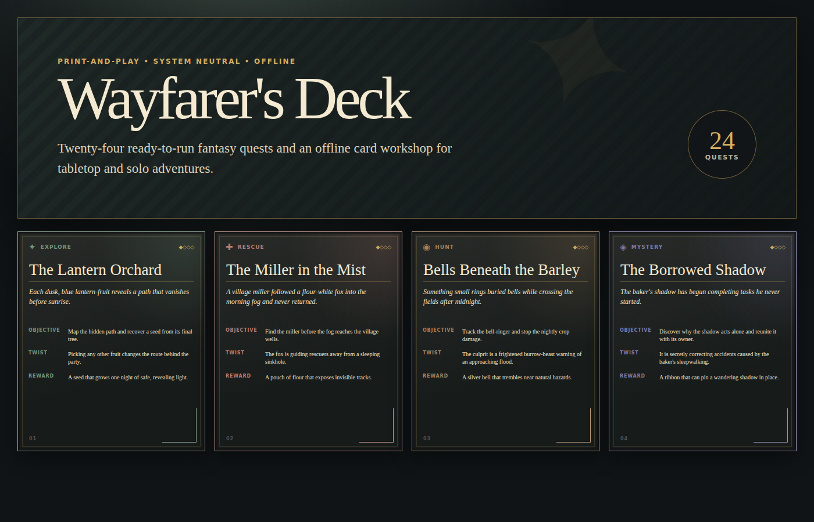
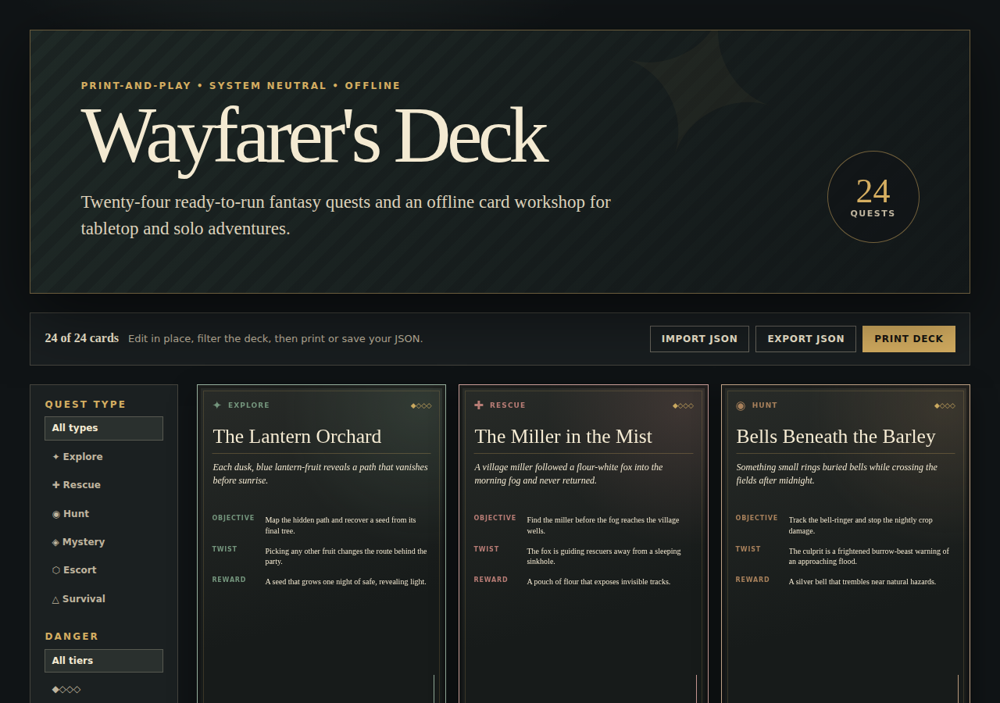

# Wayfarer's Deck

**24 editable, system-neutral fantasy quest cards plus an offline print workshop.** Draw a card, customize it in the browser, export JSON, or print a 63 × 88 mm deck.

**Price:** $5.99 USDC on Base · one-time purchase  
**Current beta endpoint:** https://made-particle-issues-adjust.trycloudflare.com/download  
**x402 discovery:** https://made-particle-issues-adjust.trycloudflare.com/.well-known/x402  
**x402.jobs listing:** https://www.x402.jobs/resources/made-particle-issues-adjust-trycloudflare-com/wayfarer-s-deck-quest-card-mini-kit-base  
**Agent Tools listing:** https://agent-tools.cloud/services/made-particle-issues-adjust-trycloudflare-com-sub74  
**PayanAgent buy route:** https://payanagent.com/x402/kh79svbs2fvr1k0vahf13690js8aeskv

An x402-capable client is required. Request a buy URL, read the x402 v2 payment requirements from the `402 Payment Required` response, settle them, then retry the same request with payment proof. The paid response is either the ZIP archive or a one-time delivery URL, depending on marketplace. **Do not send USDC directly to the recipient address:** a direct transfer cannot authorize delivery.

## Inside the archive

- 24 hooks, objectives, twists, and rewards across six quest types and four danger tiers;
- editable offline browser workshop;
- JSON import/export and source deck;
- three-page A4 print PDF with 63 × 88 mm cards;
- cover, preview, customer license, and integrity manifest.

No account, subscription, tracking, or internet connection is required after download.

## Try three quests

Read [three complete sample cards](samples/three-quest-samples.md) before buying.

## Delivery integrity

`quest-card-mini-kit-v1.0.zip` · 1,094,153 bytes  
SHA-256: `56cac0a97aebf11d4de2cc4953929716ba438a588ee5990ebc9f6dead432d538`

## Beta availability

The purchase endpoint currently runs through a temporary Cloudflare Quick Tunnel. It may change or be briefly unavailable; this repository is the canonical place for the current endpoint. Last verified: **2026-07-13 01:02 UTC**.

## Rights and disclosure

A completed purchase grants the usage rights in [CUSTOMER-LICENSE.txt](CUSTOMER-LICENSE.txt). Generative AI assisted initial text drafting; the deck was selected, reviewed, balanced, visually designed, tested, and packaged as one curated product. No intentionally borrowed fictional properties are included.

The promotional assets and samples in this repository are copyright © 2026. No license to redistribute this repository as a competing card or prompt product is granted.
